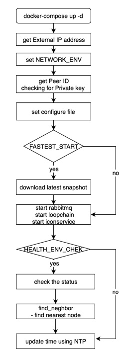

# prep-node docker

#### Latest docker tag
[](https://microbadger.com/images/iconloop/prep-node "microbadger.com")
[](https://microbadger.com/images/iconloop/prep-node "microbadger.com")


#### Travis-build
[](https://travis-ci.org/JINWOO-J/prep_docker) 


## Introduction to prep-node
This project was created to help ICON's PRep-node.

## How to build docker image

```bash
prep_docker (master) ✗ make build_python
 ----- Build Environment -----

  DOCKERIZE_VERSION="v0.6.1"
  DOWNLOAD_PACKAGE="http://tbears.icon.foundation.s3-website.ap-northeast-2.amazonaws.com/docker_resource/1910211829xc2286d/docker_1910211829xc2286d_packages.tar.gz"
  GO_VERSION="1.12.7"
  ICON_RC_VERSION="1.0.0"
  IS_LOCAL=true
  NAME=prep-node
  RABBITMQ_VERSION="3.7.17"
  REPO_HUB=iconloop
  TAGNAME=1909261038x4fa4a5
  VERSION=1909261038x4fa4a5
docker build --no-cache --rm=true -f python_37/Dockerfile \
		 --build-arg DOCKERIZE_VERSION=v0.6.1   --build-arg DOWNLOAD_PACKAGE=http://tbears.icon.foundation.s3-website.ap-northeast-2.amazonaws.com/docker_resource/1909261038x4fa4a5/docker_1909261038x4fa4a5_packages.tar.gz   --build-arg GO_VERSION=1.12.7   --build-arg ICON_RC_VERSION=1.0.0   --build-arg IS_LOCAL=true   --build-arg NAME=prep-node   --build-arg RABBITMQ_VERSION=3.7.17   --build-arg REPO_HUB=iconloop   --build-arg TAGNAME=1909261038x4fa4a5   --build-arg VERSION=1909261038x4fa4a5   \
		-t iconloop/prep-node:1910211829xc2286d .
Sending build context to Docker daemon  21.42MB
Step 1/44 : FROM python:3.7.3-slim-stretch
 ---> 338ae06dfca5
Step 2/44 : LABEL maintainer="JINWOO <jinwoo@iconloop.com>"
 ---> Running in 4804b6987e20
Removing intermediate container 4804b6987e20
 ---> aa348d5ab934
Step 3/44 : ENV TZ "Asia/Seoul"
 ---> Running in a42cf9cf045e
Removing intermediate container a42cf9cf045e
 ---> 4b94bc713990
Step 4/44 : ENV TERM "xterm-256color"
 ---> Running in 6a7f30c9acdb
Removing intermediate container 6a7f30c9acdb
 ---> 1dea771bb6be
Step 5/44 : ENV USERID 24988
 ---> Running in cd88bf497d89
Removing intermediate container cd88bf497d89
```

## Entrypoint.sh diagram



